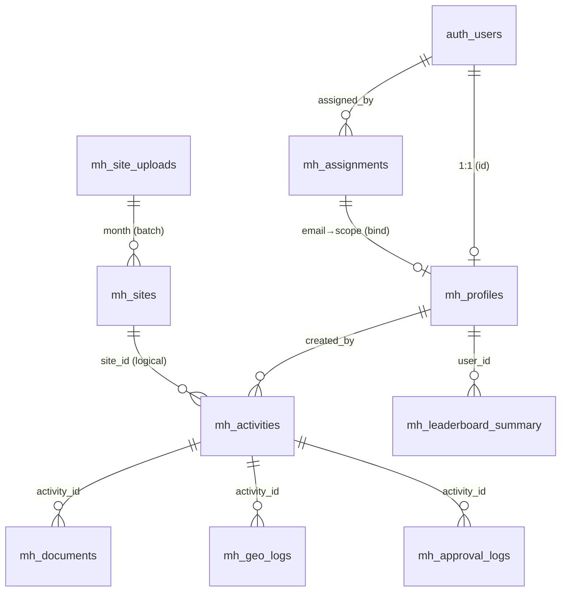

# MartaHub — Specification Document

**Sistem:** MartaHub — Centralized Marketing Execution Platform (Trade Marketing & Visibility, IOH Sumatera)
**Cakupan dokumen:** Integrasi **Mobile App (Flutter)** + **Web (`/martahub`)** di atas satu backend Supabase bersama, beserta **model relasional (relational tables)** secara detail.
 **Status:** Living document — mencerminkan kondisi kode saat penulisan.

---

## 1. Ringkasan & Prinsip Arsitektur

MartaHub adalah platform eksekusi lapangan pemasaran: petugas lapangan (**BME/RGE**) menyusun *plan* kegiatan, melakukan *check-in* berbasis lokasi, lalu melaporkan *actual*; jenjang manajerial (**TMV/Head/Admin**) mengelola master data, provisioning akun, approval, dan monitoring.

Dua klien berbagi **satu** project Supabase (PostgreSQL + Auth + Storage + RPC):

```
        ┌─────────────────────────┐        ┌──────────────────────────────┐
        │  MOBILE APP (Flutter)   │        │   WEB — /martahub (Next.js)  │
        │  Eksekusi lapangan      │        │   Back-office & admin         │
        │  BME / RGE (+ view mgr) │        │   Head / TMV / Admin          │
        └───────────┬─────────────┘        └───────────────┬──────────────┘
                    │  supabaseMarta (anon)                 │  supabaseMarta (anon)
                    │  Auth · RPC · Table · Storage          │  Auth · RPC · Table
                    └───────────────┬───────────────────────┘
                                    ▼
                    ┌───────────────────────────────────────┐
                    │  SUPABASE (project ref: pemltwhyidrajbyzynks) │
                    │  • auth.users (Email OTP + Google)     │
                    │  • Tabel mh_* (RLS aktif)              │
                    │  • RPC mh_* (SECURITY DEFINER)         │
                    │  • Storage bucket: mh-photos           │
                    └───────────────────────────────────────┘
```

**Prinsip kunci**

1. **Backend tunggal sebagai kontrak integrasi.** Mobile dan Web tidak saling memanggil; keduanya berbicara ke tabel & RPC `mh_*` yang sama. Konsistensi data dijamin di sisi database (constraint, RLS, RPC `SECURITY DEFINER`).
2. **Email = identitas + kunci mapping.** Login akun IOH memakai **email + OTP** (One-Time Password — kode sekali-pakai yang dikirim ke email, **bukan** password statis), dengan opsi tambahan **Sign in with Google**. **Microsoft/Outlook (Azure) tidak dikoneksikan** (butuh app registration di tenant Entra ID IOH oleh IT Indosat).
3. **Pre-provision + pending.** Akses ditentukan lebih dulu oleh atasan (allowlist `mh_assignments`). User yang belum ter-map masuk status **pending**.
4. **Scope-driven RBAC.** Role + kolom scope (`region`, `brand`, `branch_id`) menentukan data yang terlihat, bukan ledakan kode role.
5. **Master data bulanan.** Struktur wilayah (Region→Area→Branch×Brand) berasal dari **List Site** yang diunggah tiap bulan lewat Web.

---

## 2. Aktor & Hierarki Role (RBAC)

| Lapis | Jabatan | Kode `role` | Scope data | Klien utama | Bisa provisioning |
|-------|---------|-------------|------------|-------------|-------------------|
| 0 | Super Admin | `admin` | Semua | Web | Ya (semua) |
| 1 | Head of Trade Marketing & Visibility | `head` | Semua region×brand | Web | Ya |
| 2 | TM & Visibility | `tmv` | 1 Region × 1 Brand | Web | Ya (branch di scope-nya) |
| 3 | Petugas Lapangan — **BME** | `bme` | 1+ Branch × Brand | Mobile | Tidak |
| 3 | Petugas Lapangan — **RGE** | `rge` | 1+ Branch × Brand | Mobile | Tidak |
| — | Belum ter-map | `pending` | Tidak ada | Mobile/Web | Tidak |

- **BME & RGE = fungsional identik.** Role, scope, dan kewenangannya **sama persis**; `bme`/`rge` dipertahankan **hanya sebagai label/remark** untuk membedakan penamaan. **Tidak ada lagi pembagian urban/rural** — kolom `coverage` **dihapus** dari sistem.
- **Brand:** `im3` (IM3) atau `tri` (3ID). Beberapa entitas boleh `both` (khusus master `mh_branches` legacy).
- **Region:** kanonik `north` / `central` / `south` (v2). Data operasional Web memakai label penuh (`NORTH SUMATERA`, `CENTRAL SUMATERA`, `SOUTH SUMATERA`) — lihat §11 *Open Items* untuk normalisasi.

---

## 3. Autentikasi & Provisioning

### 3.1 Model
- **Login (metode aktif saat ini):**
  - **Email + OTP** — metode utama untuk akun IOH (`@ioh.co.id`). Dua tahap: user memasukkan email → menerima **kode OTP** (sekali-pakai) di inbox → verifikasi kode. **Passwordless** (tidak ada password statis) dan **tidak** perlu konfigurasi IdP eksternal. Implementasi: Supabase `signInWithOtp` (`sendEmailCode`) → `verifyOTP` (`verifyEmailCode`, `OtpType.email`).
  - **Sign in with Google** — opsi OAuth satu-klik via deep link `martahub://login-callback`.
  - **Microsoft/Outlook (Azure)** — kode pemanggilnya sudah ada (`signInWithOutlook`, `OAuthProvider.azure`) namun **belum dikoneksikan/aktif**: memerlukan app registration di tenant Entra ID IOH (butuh IT Indosat). **Tidak dipakai** pada alur saat ini.
- **Deep link** `martahub://` (Android `intent-filter`, iOS `CFBundleURLSchemes`) dipakai untuk callback OAuth (Google); Web memakai redirect URL biasa.
- **Allowlist:** tabel `mh_assignments` (satu email = satu assignment aktif; `unique index` pada `lower(email) where status='active'`).
- **Auto-bind:** trigger `mh_on_auth_user_created` → fungsi `mh_handle_new_user()` mencocokkan `auth.users.email` ke `mh_assignments` aktif, lalu mengisi `mh_profiles` (role+scope) atau `status='pending'`.
- **Rebind:** RPC `mh_rebind_me()` meng-upgrade profil pending→aktif setelah admin meng-assign (dipanggil klien saat login/refresh).

### 3.2 Alur sign-in (sequence)

```
User → Email + OTP (kode ke inbox)  ·  atau  Sign in with Google → auth.users row
     → trigger mh_handle_new_user()
         ├─ email ada di mh_assignments(active) → mh_profiles.status='active' + role/scope terisi
         └─ tidak ada → mh_profiles.status='pending'
Klien membaca mh_profiles:
     ├─ active  → masuk penuh (mobile: /home ; web: dashboard sesuai role)
     └─ pending → halaman Pending (tampil email + tombol Copy; tanpa akses data)
Admin/TMV meng-assign email → user refresh / mh_rebind_me() → naik ke active
Revoke assignment → user turun ke pending (bukan dihapus; audit tetap ada)
```

### 3.3 Gate klien
- **Mobile** (`app_router.dart`): `/splash` → `/login` → `/email-login` (dua tahap: email → kode OTP) → (`/pending` | `/revoked` | `/home`). Guard berdasarkan state auth (`signedIn` / `pending` / `active`).
- **Web** (`MartaShell`): render menu sesuai `ctx.canManage` (Head/TMV/Admin).

---

## 4. Modul & Tanggung Jawab per Klien

### 4.1 Mobile App (Flutter `marta_hub`)
Rute (`go_router`):

| Route | Layar | Fungsi |
|-------|-------|--------|
| `/splash` | Splash | Bootstrapping sesi |
| `/login` | Login | Input email (kirim kode OTP) · tombol Sign in with Google |
| `/email-login` | Email OTP | Dua tahap: masukkan email → verifikasi kode OTP |
| `/pending`, `/revoked` | Pending/Revoked | Status akun belum/di-nonaktifkan |
| `/home` | Dashboard | Skor achievement bulan, misi hari ini, aksi cepat, chart mingguan, aktivitas terbaru |
| `/activities` | Activity List | Daftar plan (grup: Perlu Aksi / Akan Datang / Riwayat), filter status, search |
| `/activities/new` | Create Plan | Wizard 4 step (Plan Info → Target → Location → Review) |
| `/activities/:id` | Plan Detail | Detail kegiatan |
| `/activities/:id/checkin` | Check-in | Validasi lokasi vs koordinat site |
| `/activities/:id/submit` | Submit Actual | Input hasil (SP/FWA/Rebuy/Revenue/Cost) + insight + foto |
| `/map` | Map View | Peta site/kegiatan |
| `/leaderboard` | Leaderboard | Peringkat pencapaian |
| `/team` | User Management | (Manager) assignment akun |
| `/profile` | Profile | Profil & scope |

Data access mobile: tabel `mh_activities`, `mh_profiles`, `mh_sites`, `mh_documents`; RPC `mh_home_scope`, `mh_rebind_me`, `mh_set_my_name`, `mh_branch_brand_list`, `mh_list_assignments`, `mh_assign_user`, `mh_update_assignment`, `mh_delete_assignment`, `mh_dismiss_pending`; Storage bucket `mh-photos`.

### 4.2 Web MartaHub (`tracehub/app/martahub`)
Menu (`MartaShell`):

| Menu | Path | Fungsi |
|------|------|--------|
| Dashboard | `/martahub` | Ikhtisar |
| Activity Plan | `/martahub/activities` | Kelola/monitor plan |
| Activity Submission | `/martahub/submission` | Pantau submission actual |
| Activity Monitoring | `/martahub` | Monitoring |
| Map Intelligence | `/martahub/map` | Peta wilayah/leaflet |
| Leaderboard | `/martahub/leaderboard` | Peringkat (dari `mh_leaderboard_summary`) |
| Approval Center | `/martahub/approval` | Approve/reject submission |
| User Management | `/martahub/assignments` | Provisioning akun ↔ branch×brand |
| **Master Data** | `/martahub/master` | List Site upload + Batas Wilayah + **Struktur Branch & Brand (hirarki)** |

Data access web: tabel `mh_activities`, `mh_profiles`, `mh_leaderboard_summary`; RPC `mh_list_sites`, `mh_branch_brand_list`, `mh_list_assignments`, `mh_assign_user`, `mh_update_assignment`, `mh_delete_assignment`, `mh_dismiss_pending`, `mh_import_sites`, `mh_finalize_sites_import`, `mh_site_import_history`, `mh_log_site_import`.

### 4.3 Matriks tanggung jawab (integrasi)

| Domain | Web (`/martahub`) | Mobile (Flutter) |
|--------|-------------------|------------------|
| Provisioning akun (allowlist) | **Owner** (assign/revoke) | View (manager) |
| Master Data / List Site (bulanan) | **Owner** (upload, import, finalize) | Konsumen (pilih site saat plan) |
| Struktur Branch–Brand–Akun | **Owner** (hirarki + status pengisian akun) | — |
| Activity Plan | Monitor | **Owner** (buat plan) |
| Check-in lokasi | — | **Owner** |
| Submit actual + foto | Monitor | **Owner** |
| Approval | **Owner** | — |
| Leaderboard | Tampil (summary) | Tampil |

---

## 5. Alur End-to-End (Integrasi Mobile ⇄ Web)

**A. Provisioning → akses**
1. Web: Head/TMV membuka User Management, memilih role + region + brand + branch(×brand), memasukkan **email** → `mh_assign_user`.
2. User buka Mobile → login (email OTP / Google) → auto-bind → masuk penuh (atau pending jika belum di-assign).

**B. Master Data bulanan (Web) → plan (Mobile)**
1. Web Master Data: pilih bulan → upload file **List Site** (`.xlsb/.xlsx/.xls/.csv`) → preview & mapping kolom → `mh_import_sites` (progres per-chunk) → `mh_finalize_sites_import` (nonaktifkan site lama, catat via `mh_log_site_import`).
2. `mh_sites` diperbarui; `mh_branch_brand_list` menghasilkan kombinasi Branch×Brand terbaru.
3. Mobile: saat membuat plan, daftar site/MC dibaca dari `mh_sites` sesuai scope.

**C. Siklus Activity (lintas klien)**
```
Mobile: Create Plan (draft) ─▶ Check-in (checkin_valid) ─▶ Submit Actual (status=submitted, +foto)
                                                              │
Web:  Approval Center ─▶ approved / rejected ────────────────┘
                                                              ▼
                       mh_leaderboard_summary (refresh) ─▶ Leaderboard (mobile & web)
```

### 5.1 Rincian Alur Pengguna (Step-by-Step)

Notasi: **U** = aksi pengguna, **S** = respons sistem. Setiap alur menyebut aktor, prasyarat, dan hasil akhir.

**F1 — Provisioning akun** · Aktor: Head / TMV / Admin · Klien: Web (`/martahub/assignments`)
1. U: Buka **User Management** → klik **Tambah**.
2. U: Pilih **role** (`head` / `tmv` / `bme` / `rge`). Untuk `tmv` pilih Region + Brand; untuk `bme`/`rge` pilih satu/banyak **branch × brand** dari grid (data dari `mh_branch_brand_list`).
3. U: Isi **nama** + **email** korporat (`@ioh.co.id`) → **Simpan**.
4. S: Panggil `mh_assign_user` (SECURITY DEFINER) → buat baris `mh_assignments` (`status='active'`, `coverage=null`). Kombinasi yang sudah aktif untuk email itu dikunci agar tak dobel.
5. Hasil: email masuk allowlist; siap dipakai user untuk login.

**F2 — Sign-in (Email OTP)** · Aktor: semua role · Klien: Mobile
1. U: Buka app → `/splash` → `/login`.
2. U: Ketik **email** → tombol **Kirim Kode** (atau pakai **Sign in with Google**).
3. S: `signInWithOtp` mengirim **kode OTP** ke inbox; pindah ke `/email-login` tahap-2.
4. U: Masukkan **kode OTP** → **Verifikasi**.
5. S: `verifyOTP` membuat sesi → trigger `mh_handle_new_user()` mencocokkan email ke `mh_assignments`.
6. S: Klien membaca `mh_profiles.status` → **active** (`/home`), **pending** (`/pending`), atau **revoked** (`/revoked`).
7. Hasil: user aktif masuk penuh sesuai scope; pending melihat email + tombol Copy.

**F3 — Pending → Aktif** · Aktor: user pending + atasan · Klien: Mobile + Web
1. U (user): Di `/pending`, salin email, kirim ke Marcomm Region.
2. U (atasan): Jalankan **F1** untuk email tersebut.
3. U (user): Tekan **refresh** / login ulang.
4. S: `mh_rebind_me()` meng-upgrade profil pending → **active** (role+scope terisi).
5. Hasil: user langsung mendapat akses tanpa daftar ulang.

**F4 — Import List Site bulanan** · Aktor: Admin · Klien: Web (`/martahub/master`)
1. U: Master Data → **List Site (Branch)** → pilih **bulan** (default bulan berjalan) → **Konfirmasi**.
2. U: **Pilih berkas** (`.xlsb/.xlsx/.xls/.csv`).
3. S: Membaca workbook → tampilkan **preview**.
4. U: Klik **baris header** yang benar (baris di atasnya diabaikan) → kolom kunci **dicocokkan otomatis**; koreksi bila meleset (minimal Site ID & Branch).
5. U: **Import** → S: `mh_import_sites` per-chunk dengan **progress bar**; lalu `mh_finalize_sites_import` menonaktifkan site lama & `mh_log_site_import` mencatat riwayat.
6. S: `SitesBrowser` memuat ulang `mh_sites` (paginasi + indikator progres).
7. Hasil: `mh_sites` bulan ini aktif; `mh_branch_brand_list` memutakhirkan kombinasi Branch×Brand.

**F5 — Buat Plan Activity** · Aktor: BME / RGE · Klien: Mobile (`/activities/new`)
1. U: Dari `/home` (Aksi Cepat **Plan**) atau `/activities` → **+ Buat Plan Activity**.
2. U — **Step 1 Plan Info**: pilih Event Category, isi Event Name, pilih Plan Date, pilih Cluster/Area (MC); Branch & BME/RGE otomatis (read-only) dari profil; set Network & Area Potential.
3. U — **Step 2 Target**: isi Target SP (wajib) + FWA + Rebuy (opsional) + Budget Cost (wajib).
4. U — **Step 3 Location**: pilih **Site** (dari `mh_sites` sesuai MC) + POI Type; detail site (koordinat) tampil.
5. U — **Step 4 Review** → **Buat Plan Activity**.
6. S: Insert `mh_activities` (`status='draft'`, target & scope terisi) → daftar plan diperbarui.
7. Hasil: plan baru muncul di `/activities` (grup Akan Datang / Perlu Aksi).

**F6 — Check-in lokasi** · Aktor: BME / RGE · Klien: Mobile (`/activities/:id/checkin`)
1. U: Buka plan hari ini → **Check In**.
2. S: Ambil **GPS** perangkat → hitung **jarak** ke koordinat site → tentukan **valid** (dalam radius) / invalid.
3. S: Update `mh_activities` (`checkin_lat/lng`, `checkin_distance`, `checkin_valid`, `checkin_at`, `geo_compliant`); catat `mh_geo_logs`.
4. Hasil: kartu plan menandai **"Sudah check-in"**; aksi berikutnya = Isi Report.

**F7 — Submit Actual + Foto** · Aktor: BME / RGE · Klien: Mobile (`/activities/:id/submit`)
1. U: Buka plan yang sudah check-in → **Isi Report**.
2. U: Isi Actual **SP/FWA/Rebuy**, **Revenue**, **Cost**, dan **insight/kendala**; lampirkan **foto**.
3. S: Upload foto ke bucket `mh-photos` → catat `mh_documents` (`storage_path`); update `mh_activities` (`actual_*`, `status='submitted'`).
4. S: Hitung KPI (`achievement_pct`, `productivity_pct`) — lihat §9.
5. Hasil: kegiatan berstatus **submitted**, menunggu approval.

**F8 — Approval** · Aktor: TMV / Head · Klien: Web (`/martahub/approval`)
1. U: Buka **Approval Center** → pilih submission.
2. U: Tinjau data + foto → **Approve** atau **Reject** (+ catatan).
3. S: Update `mh_activities.status` → `approved` / `rejected`; catat `mh_approval_logs` (`reviewer_id`, `action`, `notes`).
4. Hasil: status final; feed leaderboard/monitoring diperbarui.

**F9 — Pantau Struktur & isi Branch kosong** · Aktor: Head / TMV · Klien: Web (`/martahub/master` → Struktur Branch & Brand)
1. U: Buka **Struktur Branch & Brand** → tree Region → Brand → Branch.
2. S: Gabungkan `mh_branch_brand_list` + `mh_list_assignments`; hitung badge **Terisi/Kosong** per branch×brand (BME/RGE = label).
3. U: Cari branch badge **Kosong** → lanjut ke **F1** untuk mengisi petugas lapangan.
4. Hasil: cakupan pengisian akun terpantau; gap cepat ditutup.

**F10 — Lihat performa** · Aktor: semua · Klien: Mobile `/home` & `/leaderboard`, Web `/martahub/leaderboard`
1. U: Buka Dashboard → skor achievement bulan, chart mingguan (interaktif), aktivitas terbaru.
2. U: Buka Leaderboard → peringkat dari `mh_leaderboard_summary` (di-refresh berkala).
3. Hasil: pemahaman capaian pribadi & tim.

---

## 6. Model Relasional (Detail)

> Skema berevolusi **v1 → v2**. **v2 (`supabase_schema_v2.sql`) adalah kanonik** dan yang dibaca aplikasi (`mh_profiles`, `mh_assignments`, `mh_sites`, `mh_activities` extended). Beberapa tabel v1 masih relevan secara operasional (dokumen, geo-log, approval, leaderboard). Perbedaan penamaan dicatat di §11.

### 6.1 ER Overview



### 6.2 `mh_profiles` — Profil & scope user (kanonik v2)
| Kolom | Tipe | Keterangan |
|-------|------|-----------|
| `id` (PK) | uuid | FK → `auth.users(id)` ON DELETE CASCADE |
| `email` | text | disimpan lowercase |
| `full_name` | text | |
| `role` | text | `admin\|head\|tmv\|bme\|rge\|pending` (default `pending`) |
| `region` | text | `north\|central\|south` |
| `brand` | text | `im3\|tri\|both` |
| `branch_id` | text | |
| `branch_name` | text | |
| ~~`coverage`~~ | text | **Dihapus** — dulu `urban`(BME)/`rural`(RGE); pembagian ditiadakan |
| `status` | text | `active\|pending` (default `pending`) |
| `assignment_id` | uuid | referensi ke `mh_assignments` yang mem-bind |
| `created_at`,`updated_at` | timestamptz | trigger `mh_touch` |

### 6.3 `mh_assignments` — Allowlist / pre-provision (v2)
| Kolom | Tipe | Keterangan |
|-------|------|-----------|
| `id` (PK) | uuid | `uuid_generate_v4()` |
| `email` | text NOT NULL | lowercase; **unik saat `status='active'`** |
| `role` | text NOT NULL | CHECK `head\|tmv\|bme\|rge` |
| `region` | text | `north\|central\|south` |
| `brand` | text | CHECK `im3\|tri` |
| `branch_id`,`branch_name` | text | |
| ~~`coverage`~~ | text | **Dihapus** (dulu CHECK `urban\|rural`) |
| `month` | text | `YYYYMM` sumber List Site |
| `assigned_by` | uuid | FK → `auth.users(id)` |
| `status` | text NOT NULL | CHECK `active\|revoked\|orphan` (default `active`) |
| `note` | text | |
| `created_at`,`updated_at` | timestamptz | |

Index: `unique(lower(email)) where status='active'`; `(region, brand, branch_id)`.

### 6.4 `mh_sites` — List Site ternormalisasi (v2)
| Kolom | Tipe | Keterangan |
|-------|------|-----------|
| `id` (PK) | uuid | |
| `site_id` | text NOT NULL | **unik bersama brand** → `unique(site_id, brand)` |
| `site_name` | text | |
| `brand` | text NOT NULL | CHECK `im3\|tri` (baris per brand) |
| `circle`,`region`,`area` | text | hierarki wilayah |
| `branch_id`,`branch` | text | |
| `provinsi`,`kabupaten`,`kecamatan` | text | |
| ~~`coverage`~~ | text | **Dihapus** — kolom KEC RURAL/URBAN tak lagi dipetakan |
| `mc` | text | IM3: MC; 3ID: Cluster 3ID |
| `site_type` | text | |
| `network_cat` | text | CHECK `strong\|medium\|weak` |
| `area_potential` | text | CHECK `high\|medium\|low` |
| `latitude`,`longitude` | double precision | **CONFIDENTIAL** — hanya untuk jarak check-in |
| `first_seen_month`,`last_seen_month` | text | |
| `active` | boolean | default true |
| `created_at`,`updated_at` | timestamptz | |

Index: `(branch_id, brand)`, `(mc)`.

### 6.5 `mh_site_uploads` — Batch upload List Site (v2)
| Kolom | Tipe | Keterangan |
|-------|------|-----------|
| `id` (PK) | uuid | |
| `month` | text NOT NULL | `YYYYMM` |
| `total`,`new_count` | integer | ringkasan import |
| `uploaded_by` | uuid | FK → `auth.users(id)` |
| `created_at` | timestamptz | |

> Riwayat import juga dipapar lewat RPC `mh_site_import_history` / dicatat via `mh_log_site_import`.

### 6.6 `mh_activities` — Plan + Check-in + Actual (superset v1+v2)
Tabel inti siklus kegiatan. Kolom digabung dari v1 (plan+actual+KPI) dan extend v2 (multi-kategori, 3-step, check-in).

**Identitas & relasi**
| Kolom | Tipe | Keterangan |
|-------|------|-----------|
| `id` (PK) | uuid | |
| `created_by` | uuid | FK → `auth.users(id)` (pemilik) |
| `approved_by` | uuid | FK → `auth.users(id)` |
| `branch_id` | text | (v1 FK → `mh_branches`) |
| `brand` | text | `im3\|tri` |

**Step 1 — Plan Info**
| Kolom | Tipe | Keterangan |
|-------|------|-----------|
| `event_name` / `title` | text | nama kegiatan |
| `event_category` | text | v1 tunggal: `directSelling\|sponsorship\|thematic\|jointEvent` |
| `event_categories` | jsonb | v2 multi: `directSelling\|jointEvent\|openBooth\|project\|sponsorship\|thematic` |
| `mc` | text | Micro Cluster |
| `plan_date` | date | v1 (1 hari) |
| `plan_date_start`,`plan_date_end` | date | v2 (rentang; end null = 1 hari) |

**Step 2 — Location**
| Kolom | Tipe | Keterangan |
|-------|------|-----------|
| `site_id` | text | (v1 FK → `mh_master_poi`) |
| `poi_type` | text | v1 tunggal |
| `poi` | jsonb | v2 multi: `government\|market\|publicArea\|sportStadium\|villages` |
| `network_category` | text | CHECK `strong\|medium\|weak` |
| `area_potential` | text | CHECK `high\|medium\|low` |
| `address` | text | |

**Target (Plan)**
| Kolom | Tipe | Keterangan |
|-------|------|-----------|
| `target_sp` | integer | Sales Point |
| `target_fwa` | integer | FWA |
| `target_rebuy` | integer | rebuy (opsional) |
| `cost_estimate` / `cost` | bigint | anggaran (Rupiah) |
| `expected_outcome` | text | |

**Step 3 — Check-in**
| Kolom | Tipe | Keterangan |
|-------|------|-----------|
| `checkin_lat`,`checkin_lng` | double precision | |
| `checkin_distance` | double precision | jarak (m) ke site |
| `checkin_valid` / `geo_valid` | boolean | valid bila dalam radius |
| `checkin_at` | timestamptz | |
| `nearest_sites` | jsonb | kandidat site terdekat |
| `geo_compliant` | boolean | dipakai perhitungan compliance |

**Actual (Submission)**
| Kolom | Tipe | Keterangan |
|-------|------|-----------|
| `actual_date` | date | |
| `actual_sp`,`actual_fwa`,`actual_rebuy` | integer | hasil |
| `revenue` / `actual_rev_3m` | bigint | pendapatan (Rupiah) |
| `cost_actual` / `cost` | bigint | biaya realisasi |
| `insight` / `notes`,`kendala` | text | catatan/insight |
| `achievement_pct`,`productivity_pct` | double precision | KPI tersimpan (lihat §9) |

**Status & waktu**
| Kolom | Tipe | Keterangan |
|-------|------|-----------|
| `status` | text | union: `draft\|planned\|checked_in\|submitted\|approved\|rejected\|revisionRequired\|inProgress\|done\|completed\|cancelled` (default `draft`) |
| `month`,`year` | text/int | periode (dipakai agregasi mobile) |
| `created_at`,`updated_at` | timestamptz | trigger `mh_touch` |

### 6.7 `mh_documents` — Foto/dokumen kegiatan (aktif di mobile)
| Kolom | Tipe | Keterangan |
|-------|------|-----------|
| `id` (PK) | uuid | |
| `activity_id` | uuid | FK → `mh_activities(id)` ON DELETE CASCADE |
| `uploader_id` | uuid | FK → `auth.users(id)` |
| `storage_path` | text | path di bucket `mh-photos` |
| `file_type` | text | mis. `photo` |
| `created_at` | timestamptz | |

> Legacy v1 setara: `mh_activity_documents` (`uploaded_by`, `file_name`, `file_url`, `doc_type photo\|video\|report\|other`). Lihat §11.

### 6.8 `mh_geo_logs` — Jejak check-in (v1, operasional)
| Kolom | Tipe | Keterangan |
|-------|------|-----------|
| `id` (PK) | uuid | |
| `activity_id` | uuid | FK → `mh_activities(id)` ON DELETE CASCADE |
| `user_id` | uuid | FK → `auth.users(id)` |
| `latitude`,`longitude` | double precision | |
| `accuracy` | double precision | |
| `distance_m` | double precision | |
| `is_valid` | boolean | |
| `logged_at` | timestamptz | |

### 6.9 `mh_approval_logs` — Audit approval (v1)
| Kolom | Tipe | Keterangan |
|-------|------|-----------|
| `id` (PK) | uuid | |
| `activity_id` | uuid | FK → `mh_activities(id)` ON DELETE CASCADE |
| `reviewer_id` | uuid | FK → `auth.users(id)` |
| `action` | text | CHECK `submitted\|approved\|rejected\|revisionRequired\|validated` |
| `notes` | text | |
| `created_at` | timestamptz | |

### 6.10 `mh_leaderboard_summary` — Peringkat pre-computed (v1)
| Kolom | Tipe | Keterangan |
|-------|------|-----------|
| `id` (PK) | uuid | |
| `user_id` | uuid | FK → `auth.users(id)` |
| `period_month`,`period_year` | integer | **unik** `(user_id, period_month, period_year)` |
| `branch_id`,`brand` | text | |
| `total_activities` | integer | |
| `achievement_pct`,`productivity_pct`,`geo_compliance` | double precision | |
| `final_score` | double precision | skor gabungan |
| `rank_overall`,`rank_branch` | integer | |
| `updated_at` | timestamptz | di-refresh berkala |

### 6.11 Tabel master legacy (v1 — untuk referensi/rekonsiliasi)
- **`mh_branches`** (`id`, `name`, `region_id`, `region_name`, `brand im3\|tri\|both`) — master branch (di-seed). Pada v2, kombinasi branch×brand diturunkan dari `mh_sites` (RPC `mh_branch_brand_list`).
- **`mh_master_poi`** (`site_id` PK, `poi_name`, `poi_type`, `lat/lng`, `branch_id`, `network_cat`, `area_potential`) — master POI awal; digantikan `mh_sites` di v2.
- **`mh_user_profiles`** (role `admin\|regionalManager\|branchManager\|mc\|bme\|rge`) — profil v1; digantikan `mh_profiles` di v2.

---

## 7. Enumerasi (Nilai Domain)

| Domain | Nilai |
|--------|-------|
| `role` (v2) | `admin`, `head`, `tmv`, `bme`, `rge`, `pending` |
| `brand` | `im3` (IM3), `tri` (3ID); `both` (master branch) |
| `region` (kanonik) | `north`, `central`, `south` |
| ~~`coverage`~~ | **Dihapus** (dulu `urban`/`rural`) |
| `network_cat` / `network_category` | `strong`, `medium`, `weak` |
| `area_potential` | `high`, `medium`, `low` |
| Event category (v2 multi) | `directSelling`, `jointEvent`, `openBooth`, `project`, `sponsorship`, `thematic` |
| POI (v2 multi) | `government`, `market`, `publicArea`, `sportStadium`, `villages` |
| Activity `status` | `draft` → `planned`/`checked_in` → `submitted` → `approved`/`rejected` (+ legacy `revisionRequired`, `inProgress`, `done`/`completed`, `cancelled`) |
| Assignment `status` | `active`, `revoked`, `orphan` |
| Profile `status` | `active`, `pending` |

---

## 8. Katalog RPC (Functions)

| RPC | Dipakai | Tujuan |
|-----|---------|--------|
| `mh_role()` | server | Ambil role user aktif |
| `mh_is_admin()` | server | True bila role ∈ {admin, head, tmv} |
| `mh_handle_new_user()` | trigger | Auto-bind profil saat user login pertama |
| `mh_rebind_me()` | Mobile | Upgrade profil pending→active setelah di-assign |
| `mh_set_my_name(...)` | Mobile | Set nama profil sendiri |
| `mh_home_scope()` | Mobile | Brand/branch yang dikuasai user (untuk filter Home) |
| `mh_list_sites(p_filters, p_limit, p_offset)` | Web | List site berpaginasi (Master Data browser) |
| `mh_branch_brand_list()` | Web + Mobile | Kombinasi Branch×Brand aktif (hirarki & pemilihan) |
| `mh_list_assignments()` | Web + Mobile | Daftar akun ter-assign (role/region/brand/branch) |
| `mh_assign_user(...)` | Web + Mobile | Buat/assign email ke slot branch×brand |
| `mh_update_assignment(p_id, ...)` | Web + Mobile | Ubah role/scope assignment |
| `mh_delete_assignment(p_id)` | Web + Mobile | Hapus assignment |
| `mh_dismiss_pending(p_id)` | Web + Mobile | Buang dari antrian pending |
| `mh_import_sites(...)` | Web | Import baris List Site (per chunk) |
| `mh_finalize_sites_import(...)` | Web | Finalisasi import (nonaktifkan site lama) |
| `mh_site_import_history()` | Web | Riwayat upload List Site |
| `mh_log_site_import(...)` | Web | Catat metadata import |

Semua RPC scope-sensitif bersifat `SECURITY DEFINER` dengan pembatasan berbasis `mh_is_admin()` / kepemilikan.

---

## 9. Formula KPI

Berdasarkan perhitungan di klien (mobile) & summary:

- **Achievement %** = `actual_sp / target_sp × 100` (per kegiatan) atau `Σ actual_sp / Σ target_sp × 100` (agregat).
- **Productivity %** = `revenue / cost × 100`, dengan `revenue = actual_rev_3m`, `cost = cost_actual ?? cost_estimate`.
- **Geo-compliance %** = proporsi kegiatan dengan `checkin_valid = true` / `geo_compliant`.
- **Final score (leaderboard)** = kombinasi `achievement_pct`, `productivity_pct`, `geo_compliance` (disimpan di `mh_leaderboard_summary.final_score`, di-refresh berkala).
- **Weekly achievement** (Home mobile): dikelompokkan per minggu (`(plan_day-1) ÷ 7`), `Σ actual_sp / Σ target_sp × 100` per minggu.

---

## 10. Keamanan (RLS & Storage)

**Row Level Security (aktif di seluruh tabel `mh_*`):**
- `mh_profiles`: user kelola profil sendiri (`auth.uid() = id`); admin/atasan read semua (`mh_is_admin()`).
- `mh_assignments`: hanya `mh_is_admin()` yang kelola; user boleh `select` entri untuk emailnya sendiri.
- `mh_sites`: semua user login boleh `select`; tulis hanya `mh_is_admin()`.
- `mh_activities`: pemilik (`created_by`) kelola miliknya; atasan (`mh_is_admin()`) lihat semua.
- `mh_geo_logs`, `mh_documents/mh_activity_documents`, `mh_approval_logs`: mengikuti kepemilikan aktivitas.
- `mh_leaderboard_summary`: read untuk semua.

**Kerahasiaan lokasi:** `latitude/longitude` site bersifat CONFIDENTIAL — hanya untuk hitung jarak check-in; disarankan lewat RPC/Edge agar tidak ter-expose mentah (catatan schema v2).

**Storage:** bucket `mh-photos`; path disimpan di `mh_documents.storage_path`; URL publik dibangun via `getPublicUrl`.

---

## 11. Catatan Evolusi Skema & Open Items

**Rekonsiliasi v1 → v2 (perlu ditegaskan agar konsisten):**
1. **Profil:** `mh_user_profiles` (v1) vs `mh_profiles` (v2). Aplikasi membaca `mh_profiles` → jadikan kanonik; retire v1.
2. **Dokumen:** `mh_activity_documents` (v1) vs `mh_documents` (v2, dipakai mobile). Standardkan ke `mh_documents` (`uploader_id`, `storage_path`, `file_type`).
3. **Master wilayah:** `mh_branches`/`mh_master_poi` (v1) vs `mh_sites` + `mh_branch_brand_list` (v2). v2 menjadi sumber kebenaran.
4. **Activity kolom ganda:** `event_category`↔`event_categories`, `poi_type`↔`poi`, `plan_date`↔`plan_date_start/end`, `checkin_valid`↔`geo_valid`, `revenue`↔`actual_rev_3m`, `cost`↔`cost_actual`. Perlu satu set final agar mobile & web tidak beda kolom.
5. **Region label:** kanonik `north/central/south` (v2) vs label penuh `NORTH/CENTRAL/SOUTH SUMATERA` (data Web). Perlu satu representasi + mapping.
6. **Coverage urban/rural dihapus.** BME & RGE kini **fungsional identik** — `bme`/`rge` bertahan **hanya sebagai label/remark**. Migrasi DB yang perlu: **drop kolom `coverage`** di `mh_profiles`, `mh_assignments`, `mh_sites` (beserta CHECK-nya), dan hentikan pemetaan kolom KEC RURAL/URBAN saat import List Site. RPC `mh_assign_user` tak lagi mengisi `p_coverage`. Klien (web) sudah berhenti mengirim coverage; **mobile & skema DB menyusul**.

**Catatan autentikasi (kondisi saat ini):**
- **Metode login aktif = Email + OTP** (passwordless, kode ke inbox) + opsi **Google**. Ini dipertahankan karena sudah berjalan baik dan **tidak bergantung pada IT Indosat**.
- **Microsoft/Outlook (Entra ID/Azure) BELUM terkoneksi.** Kode `signInWithOutlook` ada tapi non-aktif; mengaktifkannya butuh app registration + admin consent di tenant IOH (di luar kendali tim aplikasi). Selama itu belum ada, akun IOH login lewat email + OTP, bukan tombol SSO Microsoft satu-klik.
- Opsional pembatasan domain email (mis. hanya `@ioh.co.id`) bisa ditegakkan di trigger `mh_handle_new_user()`.

**Open items dari blueprint (belum final):**
- Multi-assignment: apakah satu orang boleh >1 branch/brand, atau strict 1:1.
- Penanganan branch **orphan** saat hilang dari List Site bulan baru (ditandai, bukan dihapus).
- Sumber & jadwal refresh `mh_leaderboard_summary`.
- Status project Supabase MartaHub (`pemltwhyidrajbyzynks`) — skema v2 **belum dijalankan** bila project paused.

---

## 12. Appendix — Integrasi Teknis

- **Backend:** satu Supabase project (ref `pemltwhyidrajbyzynks`).
- **Klien Web:** `supabaseMarta` (env `NEXT_PUBLIC_MARTA_SUPABASE_URL` / `NEXT_PUBLIC_MARTA_SUPABASE_ANON_KEY`); stub aman bila env belum diset (build tidak gagal).
- **Klien Mobile:** `supabaseMarta` (Flutter) + deep link `martahub://`.
- **Format List Site:** kolom nyata dari file `List Site_YYYYMM` (Region, Area, Branch, Brand, KEC RURAL/URBAN, MC/Cluster, koordinat) — lihat blueprint §2a untuk pemetaan kolom lengkap.
- **Kontrak integrasi:** setiap perubahan tabel/RPC `mh_*` adalah **breaking change lintas klien** — wajib disinkronkan antara mobile & web.

---

*Dokumen ini disusun dari kondisi codebase saat penulisan. Bagian §11 menandai area yang perlu penyelarasan sebelum rilis.*
