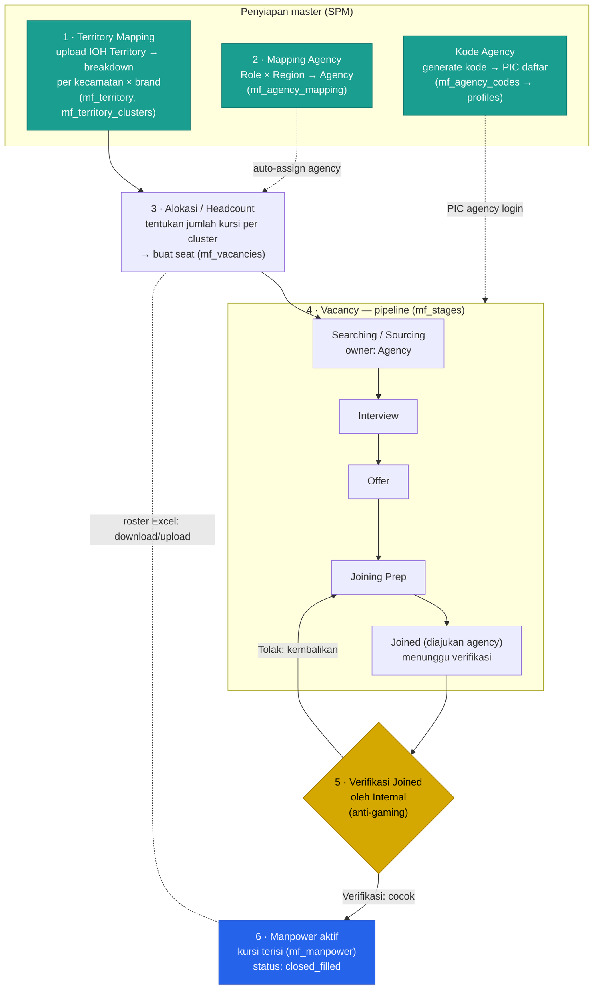

# Alur MFTS — Manpower Fulfillment Tracking System

Dokumen ini menjelaskan **alur kerja end-to-end** modul MFTS di SandraHub/TraceHub: dari menyiapkan teritori, menetapkan agency, membuka kursi kosong, mendorongnya lewat pipeline, sampai kursi terisi menjadi manpower aktif. Tujuannya satu: mengubah modul dari sekadar *pencatatan* menjadi *exception engine* — yang ditonjolkan adalah kursi yang macet, telat, atau didiamkan, bukan daftar panjang yang harus dibaca manual.

Sumber kebenaran tunggal ada di tabel `mf_*` di Supabase. Semua metrik waktu (aging, idle, over-SLA) diturunkan dari `mf_vacancy_events`, sehingga tidak ada angka yang dihitung manual dan bisa salah.

---

## Peta tab (urutan logis)

Tab di modul mengikuti urutan alur kerja, dari menyiapkan master hingga hasil akhir:

**Territory → Alokasi → Vacancy → Manpower**, ditambah **Kode Agency** sebagai tab admin (mapping agency + kode registrasi).

| Tab | Fungsi | Siapa |
|-----|--------|-------|
| **Territory** | Master kecamatan × brand (IM3 & 3ID) dari file IOH Territory | SPM |
| **Alokasi** | Menetapkan jumlah kursi (headcount) per cluster → menghasilkan vacancy | SPM / Internal |
| **Vacancy** | Action Center: kursi kosong yang sedang digarap + dorong pipeline | Internal & Agency |
| **Manpower** | Roster kursi yang sudah terisi (orang aktif) | Internal & Agency |
| **Kode Agency** | Mapping agency (Role × Region) **dan** kode registrasi agency | SPM |

> Sub-menu tipe manpower (**DSF · DSE · GSE & AE**) muncul di Vacancy, Alokasi, dan Manpower. Fase 1 memfungsikan **DSF** penuh; DSE & GSE & AE disiapkan sebagai placeholder "segera".

---

## Diagram alur

---

## Penjelasan tiap tahap

### 1 · Territory Mapping (master teritori)
SPM mengunggah file **IOH Territory** (`.xlsb`/`.xlsx`/`.xls`). Sistem memecahnya menjadi **satu baris per kecamatan per brand** (IM3 & 3ID), lengkap dengan MC/Cluster, Branch, Area, Region, dan Circle. Kolom dipilih sendiri lewat preview (klik judul kolom), sehingga tahan terhadap perubahan format file.

Kecamatan yang baru muncul bulan ini ditandai **BARU**; data lama tidak bergerak karena `first_seen_month` dikunci. Saat re-upload format terpisah MC/CS, sistem memastikan **0 cluster baru palsu**. Ada juga peringatan bila cluster yang sudah ter-*hybrid* berisiko terlepas karena geo-nya berubah.

Output: `mf_territory` (master kecamatan) dan `mf_territory_clusters` (daftar cluster + circle) yang dipakai tahap berikutnya.

### 2 · Mapping Agency (Role × Region → Agency)
Menentukan **agency mana yang mengisi** untuk tiap kombinasi *tipe manpower × region*. Pemetaan ini **data, bukan hardcode** (`mf_agency_mapping`), sehingga saat membuka vacancy, agency default otomatis terisi sesuai region.

Mapping aktif saat ini:

| Role | North Sumatera | Central Sumatera | South Sumatera |
|------|---------------|------------------|----------------|
| **DSF** | Kita Mitra Indonesia | Kita Mitra Indonesia | Kita Mitra Indonesia |
| **DSE / GSE** | Permata Indonesia | Kita Mitra Indonesia | Intrias Mandiri Sejati |

> Mengubah mapping hanya memengaruhi vacancy **baru**. Vacancy yang sudah berjalan tetap memakai agency saat dibuka.

### Kode Agency (registrasi PIC)
SPM membuat **kode registrasi** untuk tiap agency. PIC agency mendaftar di `/agency/register` memakai kode tersebut; akunnya otomatis terikat ke agency (lewat `mf_agency_id` di `profiles` + RLS). Dengan begitu setiap PIC hanya melihat data agency-nya sendiri.

Mapping Agency dan Kode Agency kini berada dalam **satu tab "Kode Agency"** untuk merapikan jumlah sub-menu.

### 3 · Alokasi / Headcount
Internal menetapkan **berapa kursi (seat)** yang dibutuhkan per cluster/brand. Setiap kursi yang belum terisi menjadi sebuah **vacancy** di `mf_vacancies`, dengan agency default sudah terisi dari Mapping Agency. Inilah jembatan antara "berapa yang seharusnya ada" (alokasi) dan "berapa yang sedang dicari" (vacancy).

### 4 · Vacancy — pipeline penggarapan
Tab **Vacancy** adalah Action Center: hanya menampilkan kursi yang **masih perlu dicari** (yang sudah terisi tidak ditampilkan di sini). Di atas tabel ada 4 kartu exception: **lewat SLA stage**, **didiamkan >5 hari (idle)**, **prioritas kritikal**, dan **total vacancy aktif**.

Setiap vacancy bergerak lewat **stage** yang configurable (`mf_stages`) — masing-masing punya *owner* (Agency atau Internal) dan *target_days* (SLA per-stage). Agency mendorong kursi maju (Searching → Interview → Offer → Joining Prep → Joined) lewat tombol **Maju**, sambil mengisi alasan/blocker (`mf_reason_codes`) dan candidate counter (sourced/interviewed/offered/declined) bila perlu. Setiap perpindahan tercatat di `mf_vacancy_events` — inilah sumber tunggal untuk timeline, aging, dan idle.

Tombol **On-Hold** menghentikan "jam" SLA saat kendala di luar kendali agency, lalu **Resume** untuk melanjutkan.

### 5 · Verifikasi Joined (anti-gaming)
Saat agency menandai **Joined**, vacancy tidak langsung tertutup. Statusnya menjadi *menunggu verifikasi* dan nama joiner muncul dengan badge **VERIFIKASI**. Internal lalu:
- **Verifikasi** → membuat record `mf_manpower` (kursi terisi), menutup vacancy (`closed_filled`), dan mengunci identitas seat.
- **Tolak** → mengembalikan kursi ke pipeline (Joining Prep / Searching) tanpa membuat manpower.

Langkah ini mencegah agency mengklaim "selesai" tanpa orang yang benar-benar bergabung.

### 6 · Manpower aktif (roster)
Tab **Manpower** menampilkan kursi yang sudah terisi. Untuk operasi massal, tersedia **Roster Excel**: *Unduh Roster* (satu baris per seat — kosong/VACANT maupun terisi), isi `NAMA_DSF`, lalu *Unggah Roster* untuk mengisi/memperbarui banyak seat sekaligus. Mengosongkan kembali nama (`VACANT`) akan membuka ulang vacancy-nya secara otomatis, menjaga konsistensi antara alokasi dan kursi nyata.

---

## Prinsip yang menjaga alur tetap "bersih"
- **Satu seat, satu kebenaran.** Vacancy (kursi dicari) dan Manpower (kursi terisi) adalah dua sisi dari `seat_id` yang sama — tidak pernah dobel.
- **Semua waktu dari event.** Aging, idle, dan over-SLA dihitung dari `mf_vacancy_events`, bukan input manual.
- **Mapping itu data.** Agency per Role × Region disimpan di tabel, bukan ditanam di kode — ganti mapping tanpa deploy ulang.
- **Exception dulu.** Yang ditonjolkan adalah yang macet/telat/didiamkan, bukan seluruh daftar.

---

*Diperbarui: 2026-06-29. Lihat juga `docs/MFTS_PLAN.md` untuk spesifikasi konsep lengkap.*
